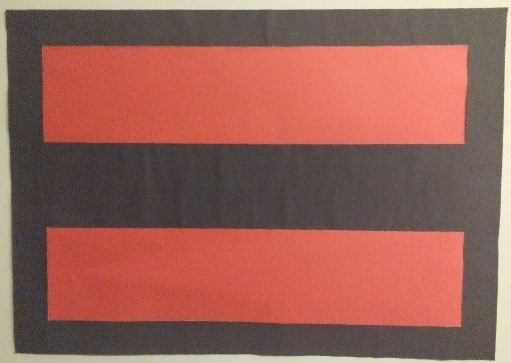
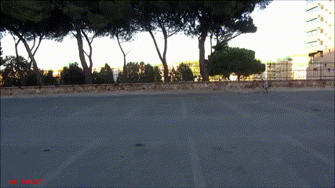

# object_tracking_eiv
Assignment for the Elaborazioni Immagini e Video (Image and Video Processing) course at University of Cagliari.

## Long story short
The objective of the project was to develop a real-time video tracking system based on an artificial marker. Other than detect the marker in the scene, the system had to be able to estimate its relative speed and the direction of movement. No other indications/suggestions were provided. The original code was written in C (project requirement), with a colleague of mine; this is a porting, just to refresh my memory about Python.

## Tested on
Python 3.7.4

OpenCV 3.4.2

## Description
We decided to create a marker to apply on a car, and after several tests on the field, we printed this final marker of size 70cm x 50cm.

  

The black bezel measures 5cm, while the central strip 10cm.
It is assumed that the marker is shooted laterally, with the camera in a fixed position (hand-held), without particular calibrations. No perpendicular/traverse motion of the marker is assumed. The video recordings were done with a Canon SX210 IS at 720p, 30 fps.

## Usage

	python main.py -i path/to/video.mp4

The attached `demo_11small.mp4` can be used as demo.
The processed video can be saved adding the `-s` flag; it will be saved in the current working directory as `output.mp4`.

##  Demo

